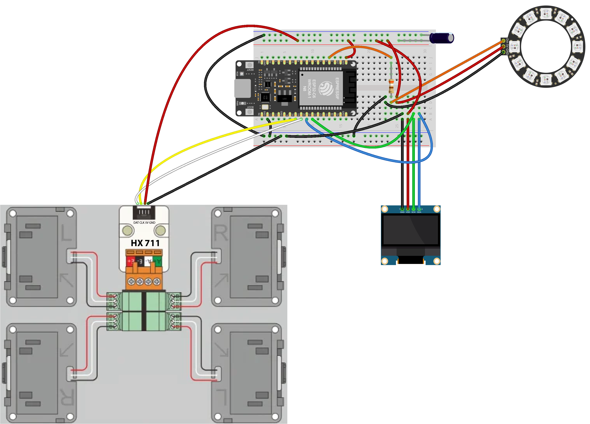
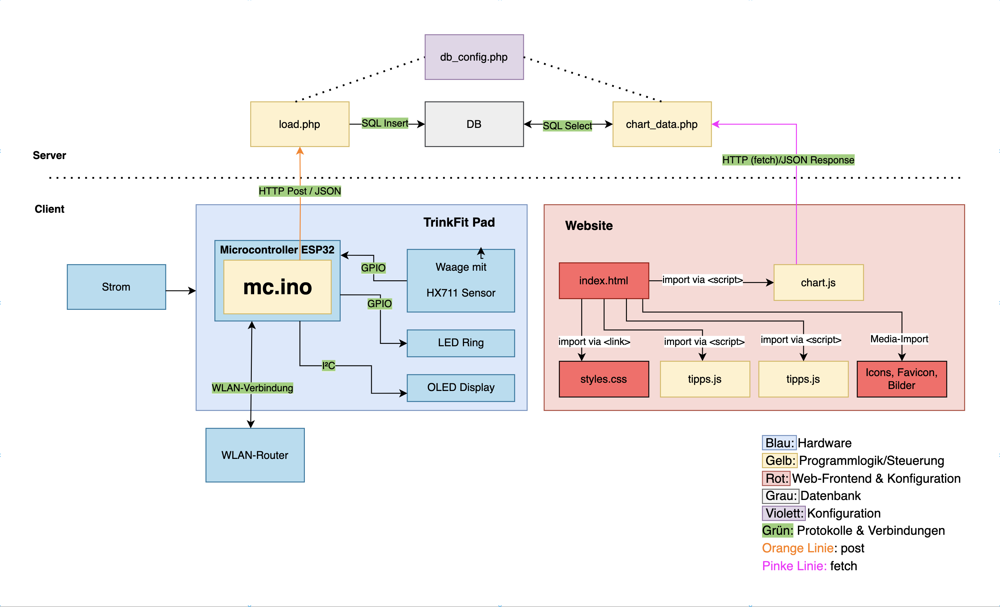
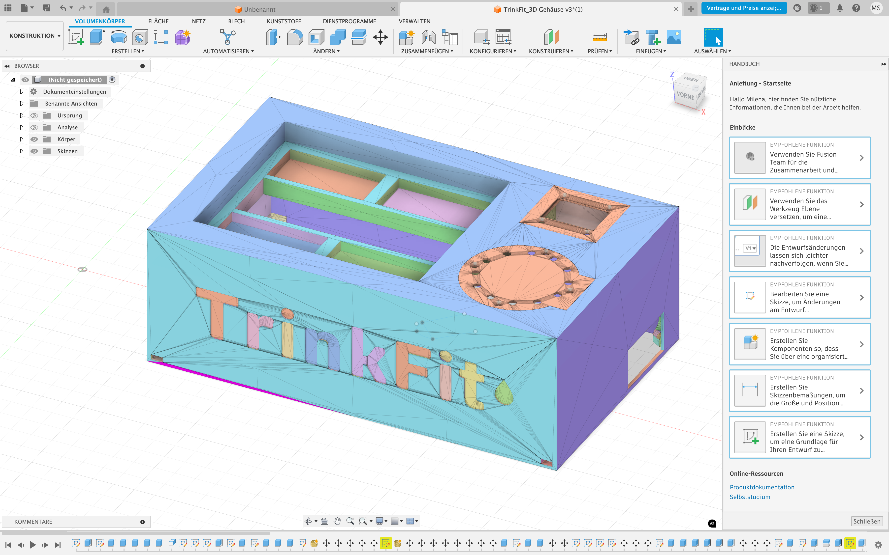

# IM4
Leistungsnachweis IM4

# TrinkFit – Ein smartes Trink-Tracking-System mit LED-Erinnerung

**TrinkFit** ist ein smartes Trinkpad, das den Wasserkonsum automatisch erfasst, online darstellt und über ein LED-System an das regelmässige Trinken erinnert. Das Projekt entstand im Rahmen des Moduls **Interaktive Medien IV** an der Fachhochschule Graubünden.

Ziel ist es, eine funktionale und visuell unterstützende Lösung zu entwickeln, die Nutzer:innen über 50 motiviert, über den Tag hinweg ausreichend zu trinken – ohne manuelles Eintragen auf dem Smartphone.

**Wie das TrinkfitPad funktioniert sieht man in diesem Video:**

Link zu unserer Website: https://trinkfit.wanaka.ch/

---

## 💡 Projektidee

Die Idee basiert auf der Beobachtung, dass viele Menschen zu wenig trinken – besonders während Beschäftigungen durch den Tag. In Interviews mit zwei Zielpersonen wurde deutlich, dass visuelle Signale wie Licht und ein möglichst automatischer Ablauf zum trinken animieren.

TrinkFit erkennt Trinkvorgänge automatisch und bietet Feedback über Lichtsignale (LED-Ring) und ein OLED-Display. Zusätzlich werden die Daten an eine Datenbank übertragen und auf der Website grafisch dargestellt. Zusätzlich bietet die Website hilfreiche Tipps und Vorteile um mehr Wasser zu trinken.

**Unsere Idee haben wir zu Beginn des Projekts in einem Flussdiagramm aufgezeichnet:**

**Link zum Flussdiagram:** https://www.figma.com/design/Npsf3iH8oIAoPRJ0vXs33R/IM-4-%E2%80%93-App-Konzeption-Milena-Stadtelmann-Wanaka-Emmenegger?node-id=1402-201&t=jZKB1xrbvuY2Au7f-1

---

## ⚙️ So wird das TrinkFit-Pad bedient

1. Schliesse das TrinkFit Pad am Strom an und starte es.
2. Warte ca. 10 Sekunden und folge den Anweisungen auf dem Display. 
3. Stelle dein volles Glas auf das TrinkFit Pad. 
4. Trinke aus dem Glas und stelle es immer wieder zurück auf das TrinkFit Pad.
5. Glas leer getrunken? Fülle es einfach wieder auf oder nimm das Glas vom TrinkFit Pad und stelle es mit dem Knopf wieder auf Reset. Nach 10 Sekunden ist das TrinkFit Pad wieder einsatzfähig.
6. Beobachte deinen Fortschritt hier online und trink dich fit.
7. Vergessen zu trinken? Mit einem Blinken erinnert dich das TrinkFit Pad nach zwei Stunden daran. Sobald du trinkst, hört es wieder auf.

**Eine detaillierte Bedienungsanleitung ist unter folgendem Link zu finden:**
https://docs.google.com/document/d/1XEH3uDcnz3PhZMaaVluLnOC8TfT7FdvxlLkdgI5IRxk/edit?usp=sharing

---

## Technische Umsetzung

Diese technischen Funktionen hat das TrinkFit Pad:

- Automatische Erkennung von Trinkmengen (via HX711-Wägezelle)
- OLED-Anzeige mit Status- und Bedienhinweisen
- LED-Ring für visuelles Feedback:
  - Startanimation bei Inbetriebnahme
  - Erinnerung nach Inaktivität (animierter Farbwechsel)
  - Erfolgssignal nach Trinkvorgang (grün)
  - Fehlerhinweis bei fehlgeschlagener Messung (rot)
- Datenübertragung an eine Online-Datenbank
- Visualisierung der Daten auf Website

Um das Projekt umzusetzen waren verschiedene Schritte nötig.
1. Hardware aufbauen
2. Gehäuse bauen
2. Hardware programmieren
3. Server aufsetzen 
4. Datenbank aufsetzen und mit Hardware verbinden
5. Website programmieren, mit Datenbank verbinden, Daten darauf auslesen und auf Server laden

**Unter diesem Link ist eine detaillierte Schritt-für-Schritt Bauanleitung abgespeichert, um das Projekt nachzubauen (inklusive Steckschema):**
https://docs.google.com/document/d/1v_iRln1-3_Z1rBspjY5z-w0nKUgZ-AYMQeU4w6nC4Hc/edit?usp=drive_link

## Komponentenübersicht:

Für die Umsetzung unseres Projekt sind folgende Komponenten nötig:

| Komponente             | Funktion                                                       |
|------------------------|----------------------------------------------------------------|
| ESP32 Dev Board        | Mikrocontroller, führt Hauptprogramm aus, kommuniziert via WLAN |
| HX711 + Wägezelle      | Gewichtssensor zur Erkennung der Trinkmenge                    |
| SSD1306 OLED Display   | Zeigt Hinweise und Statusmeldungen an                         |
| WS2812B LED-Ring       | Gibt visuelles Feedback (Erinnerung, Erfolg etc.)              |
| Powerbank (5 V)        | Mobile Stromversorgung über USB                                |

#### Protokolle & Verbindungen

| Verbindung / Protokoll | Funktion                                                        |
|------------------------|-----------------------------------------------------------------|
| GPIO                   | Datenübertragung zwischen ESP32 und Sensoren (z. B. HX711, LED) |
| I²C                    | Kommunikation mit dem OLED Display (SDA D20, SCL D21)           |
| WLAN (WiFi)            | Verbindung des ESP32 mit dem Webserver                          |
| HTTP (POST)            | Sendet JSON-Daten vom ESP32 an den Server (`load.php`)          |
| SQL (MySQL)            | Datenübertragung zwischen PHP und Datenbank                     |

#### Programmlogik / Steuerung

| Datei / Modul          | Funktion                                                       |
|------------------------|----------------------------------------------------------------|
| `mc.ino`               | Arduino-Hauptprogramm: Gewichtsmessung, Anzeige, Logik         |
| `load.php`             | Serverlogik: Empfängt Daten und schreibt sie in die Datenbank  |
| `chart_data.php`       | Serverlogik: Stellt gespeicherte Trinkdaten als JSON bereit    |
| `chart.js`             | Visualisiert Daten auf der Website                             |
| `tipps.js`             | Zeigt Trinktipps auf Website, Wechsel all 2 Minuten            |
| `popup.js`             | Eingabe von Alter und Gewicht Users, Berechnung Wasserbedarf   |

#### Web-Frontend & Konfiguration

| Komponente             | Funktion                                                       |
|------------------------|----------------------------------------------------------------|
| `index.html`           | Grundstruktur der Website                                      |
| `styles.css`           | Visuelles Styling der Website                                  |
| `db_config.php`        | Stellt Verbindung zur Datenbank her (für PHP)                  |
| Images                 | Statische Inhalte zur Darstellung                              |

Die Komponenten sind in Hardware, Protokolle und Software gegliedert und bilden gemeinsam das technische System hinter dem TrinkFit Pad. Die Programmlogik auf dem ESP32 kommuniziert über WLAN und HTTP mit dem Webserver, wo die Daten gespeichert und anschliessend visualisiert werden. Die Weboberfläche besteht aus HTML, CSS und JavaScript und ruft die Messdaten über PHP-Schnittstellen aus der Datenbank ab.

**Das wird in der folgenden Grafik veranschaulicht:**

---

### Programmierung

#### Waage

Das TrinkFit Pad wurde über die **Arduino IDE** programmiert. 

Der Ablauf ist als **Zustandsautomat** implementiert und umfasst die Phasen:
- Warten auf Glas
- Glas erkannt
- Trinken erkannt
- Erinnerung aktivieren

**Der vollständige Arduino Code ist hier zu finden:**
https://drive.google.com/drive/folders/1Nao8af1tqWhV8pDMCVJr2XZtJIiHb1tH?usp=drive_link

Die gesendeten Daten werden über eine PHP-API (`load.php`) an eine MySQL-Datenbank übermittelt.  

**Genauere Erläuterungen zu allen Codes sind im Anhang der Schritt-für-Schritt Bauanleitung aufgeführt:**
https://docs.google.com/document/d/1v_iRln1-3_Z1rBspjY5z-w0nKUgZ-AYMQeU4w6nC4Hc/edit?usp=drive_link

#### Website

Die Website wurde mit Visual Code programmiert und zeigt in Echtzeit die in der Datenbank erfassten Trinkmengen. ???

Genauere Erläuterungen zu den Codes sind in den jeweiligen Code-Abschnitten im GitHub einszusehen.

---

## ✍️ Umsetzungsprozess & Reflexion

#### Planung
Wir haben von Anfang an zügig mit dem Projekt gestartet, weil uns bewusst war, dass der Zeitplan wegen paralleler Projekte und anderer Verpflichtungen knapp wird. Durch eine klare Zielsetzung und gute Koordination konnten wir den Fortschritt hoch halten. Die Aufgaben wurden sinnvoll verteilt, sodass wir effizient arbeiten konnten. So gelang es uns, das Projekt rechtzeitig und vollständig fertigzustellen.

#### Aufgabenverteilung
Für uns war folgende Aufgabenverteilung am effizientisten. Wir haben uns aber natürlich gegenseitg im Bereich der jeweils anderen untersützt.
- Ideenfindung (beide)
- UX Design, Persona, Stylesheet, MockUp Website (beide)
- Hardware-Programmierung (Milena)
- Website-Darstellung (Wanaka)
- Produktdesign (Milena)
- Dokumentation (beide)

#### Entwicklungsprozess
Wir haben alle Komponenten – wie die Trinkwaage und die Website – zunächst separat entwickelt und jeweils ausgiebig getestet. Der Austausch im Team war dabei zentral, um sicherzustellen, dass später alles nahtlos zusammenpasst. Mit jeder Unterrichtseinheit haben wir unser System weiter optimiert und zwischen den Terminen eigenständig weitergearbeitet. Das hat sich bewährt und zu einem stabil funktionierenden Endprodukt geführt.

#### Verworfene Lösungsansätze
Einige Ideen haben sich im Verlauf des Projekts als unpraktisch herausgestellt. So wollten wir die Waage ursprünglich mit einem festen Glasgewicht tarieren – das hätte aber die Flexibilität im Alltag eingeschränkt. Auch die Idee, die Waage automatisch oder per Knopfdruck regelmässig auf null zu setzen, war keine Lösung gegen das Driften. Stattdessen nutzen wir jetzt dynamische Referenzwerte. Beim OLED-Display hatten wir anfangs nur einfache Gewichtsanzeigen geplant – letztlich wurde es als zentrales Interface mit Nutzerführung eingesetzt.

#### Designentscheidungen
Um das Breadboard mit den Kabeln zu verstecken und um das TrinkFit Pad handlicher zu machen, haben wir uns dazu entschieden, ein Gehäuse zu entwerfen. Dazu haben wir in Autodesk Fusion einen Entwurf erstellt, um das Gehäuse mit dem 3D Drucker auszudrucken.

**Hier ein Bild von dem Entwurf in Autodesk Fusion:**

**Schliesslich haben wir das Gehäuse (einmal die obere Hälfte und einmal den Boden) in dem 3D-Drucker der Schule ausgedruckt:**

Da wir noch nie mit der Software gearbeitet haben und auch noch nie ein 3D-Modell entworfen haben, war es für uns eine sehr grosse Herausforderung, das in so kurzer Zeit umzusetzen. Aufgrund der Komplexität haben wir schlussendlich darauf verzichtet den Reset Button des Microcontrollers direkt mit dem Gehäuse zu verknüpfen. Dank einer zusätzlichen Beschriftung ist dessen Bedienung nun aber trotzdem benutzerfreundlich und intuitiv.

Wir haben in dem Prozess sehr viel gelernt und sind dank der Hilfe von Jan zu einem tollen Ergebnis gekommen. 

Für die Platte auf der Waage haben wir eine leicht durchsichtige Plastikplatte zugeschnitten und mit doppelseitigem Klebeband befestigt. Diese ist nicht nur wasserabweisend, sondern sieht auch sehr schön aus. Durch zusätzliche Dekoelemente wie das angemalte Logo und die Sticker gefällt uns das TrinkFit Pad optisch sehr gut.

#### Inspiration

Von dem Thema waren wir schnell begeistert, da wir beide bei unseren Eltern, die über 50 festgestellt haben, das sie im Alltag zu wenig trinken. Aber auch wir kennen das Problem. Uns hat es motiviert, etwas zu entwickeln, das nicht nur unseren Eltern sondern auch uns selbst im Alltag nützen würde.

#### Fehlschläge und Umplanung

- Beim Anschliessen des Sensors und der anderen Komponenten auf dem Breadboard, kam es gleich zweinmal vermutlich zu einem Kurzschluss, was den Microcontroller zerstört hat. Der Grund war, dass Stromzuflüsse falsch gesteckt wurden, wodurch auf dem Board vermutlich zu viel Strom floss. Zum Glück haben wir von Jan schnell einen Ersatz bekommen. 

- Leider ist auch die erste Waage, die wir auf AliExpress bestellt haben kaputt gegangen. Die Kabelverbindungen am HX711 Sensor lösten sich und da wir keine Erfahrung im Löten haben, konnten wir ihn nicht flicken. Wir haben schliesslich eine stabilere Waage neu bestellt, die nun im Einsatz ist.

- Im Prozess der Datenbankerstellung haben wir einmal ausversehen das Dokument db_config.php auf GitHub geladen, da wir den Namen des Dokuments angepasst, aber es nicht in gitignore geändert haben. Anschliessend haben wir das Dokument über den Task Manager von Visual Codes wieder aus GitHub entfernt. Zudem haben wir das Login und Passwort angepasst, um die Sicherheit zu gewährleisten. Das selbe ist und mit dem sftp.json File passiert, da wir ausversehen im .gitignore etwas angepasst hatten. Auch hier haben wir das Dokument direkt aus GitHub entfernt und die Logindaten angepasst. Gemäss Absprache mit Jan Fiess reicht dieses Vorgehen im Rahmen dieses Projektes aus.

#### Challenges
Die grösste Herausforderung war das Programmieren der Waage. Es musste zuerst eine Logik für stabile Gewichtserkennung entwickelt und im Code umgesetzt werden. Fehler traten anfangs häufig auf – etwa durch Schwankungen oder falsche Gewichtsdifferenzen. Durch konsequentes Testen und Anpassen kamen wir schrittweise zur jetzigen, zuverlässigen Lösung. Auch das Zusammenspiel von Messung, Anzeige, LED-Steuerung und Serverkommunikation war technisch komplex.

#### Lerneffekte
- Wir haben gelernt, wie komplex eine scheinbar einfache Aufgabe wie „Trinken messen“ technisch sein kann – vor allem, wenn es genau und zuverlässig funktionieren soll. Das hat unser technisches Verständnis geschärft.
- Der sichere Umgang mit der Stromversorgung und der Schutz von sensiblen Teilen (Microcontroller) war ein wichtiges Learning für uns. Nun überlegen wir gut, wo der Strom fliesst, bevor wir etwas auf dem Breadboard ein- und umstecken.
- Die Arbeit mit GitHub und der versehentliche Upload sensibler Dateien hat uns deutlich gemacht, wie wichtig sorgfältiger Umgang mit Code und Sicherheit im Web ist.
- Beim Aufbau des Systems mussten wir lernen, wie man verschiedene Komponenten (Waage, Display, LEDs, WLAN, Server) in einem funktionierenden Gesamtsystem vereint.
- Insgesamt haben wir viele neue Fähigkeiten in den Bereichen Hardware, Webtechnologien, Microcontroller-Programmierung und im Projektmanagement entwickelt – und auch, wie man mit Fehlschlägen umgeht.

#### Known Bugs

- Die Waage kann schwanken – vor allem beim ersten Start, bei unruhigem Untergrund, schwerem Trinkgefäss oder schwacher Stromzufuhr (z. B. schwache Powerbank). Mit Gehäuse ist die Stabilität deutlich besser.
- Bei längerem Betrieb kann das Gewicht langsam nach unten driften, obwohl sich am Glas nichts verändert hat. Das ist meist unproblematisch: Nach 3 Minuten wird automatisch ein neues Referenzgewicht gesetzt. Wenn der Drift zu stark ist, denkt das System aber fälschlicherweise, dass das Glas entfernt wurde – in diesem Fall hilft ein Reset.
- Die Waage reagiert leicht verzögert, da mehrere stabile Messwerte geprüft werden. Das erhöht aber die Genauigkeit.
- Trotz diesen kleinen Bugs sind wir mit der Genauigkeit der Waage sehr zufrieden. Die Trinkmengenmessung ist zuverlässig. Unsere Tests über 3 Wochen zeigen Abweichungen von ca. ±10 ml. Falsche Einträge in der Datenbank kommen kaum vor – dank stabiler Erkennung und Sicherheitsprüfungen. Weitere Bugs sind uns nicht bekannt. 

#### Mögliche Erweiterungen für TrinkFit

- Eine Möglichkeit einbauen, um auf der Website von Hand Werte einzutragen. (Haben wir bewusst nicht gemacht, da man so zum Schummeln neigt.)
- Personalisiertes Login auf die Website mit detaillierten Statistiken
- Optimierung der Hardware, z.B. kompakteres Gehäuse oder besser zugänglicher Reset-Knopf

#### Hilfsmittel

- Für die Umsetzung des Projekts wurde ChatGPT als Hilfsmittel in fast allen Projektphasen eingesetzt. Besonders hilfreich war ChatGPT bei der Programmierung des Arduino Codes. So konnte der Code Schritt für Schritt überarbeitet und weiterentwickelt werden. Auch bei der Umsetzung der Website mittels PHP, JavaScript, HTML und CSS kam ChatGPT zum Einsatz. Zudem auch getwaves.io zur Generierung der Wellen im Header und Footer Bereich. Die KI hat dabei Schritt für Schritt beim Aufbau, der Umsetzung und Fehlersuche geholfen. ChatGPT wurde auch genutzt, um Teile der Dokumenation zu schreiben oder um sie auf die Rechtschreibung zu überprüfen. Allerdings lieferte ChatGPT bei der Textgenerierung der Dokumentation meist keine zufriedenstellende Ergebnisse. So konnten die Texte zwar als Ausgangslage genutzt, mussten aber von Hand optimiert werden.

---

## Fazit

Im Rahmen dieses Projekts haben wir sehr viel über Physical Computing gelernt. Das Thema war für uns vollkommen neu, weshalb wir uns intensiv damit beschäftigen mussten. Das hat zwar sehr viel Zeit in Anspruch genommen, hat aber auch viel Spass gemacht. Das TrinkFit Pad ist aus unserer Sicht schlussendlich noch besser herausgekommen, als wir es uns vorgestellt haben.

---

## 👥 Projektteam

- **Wanaka Emmenegger**
- **Milena Stadelmann** 

FH Graubünden  
Modul: Interaktive Medien 4 – Frühling 2025

---

