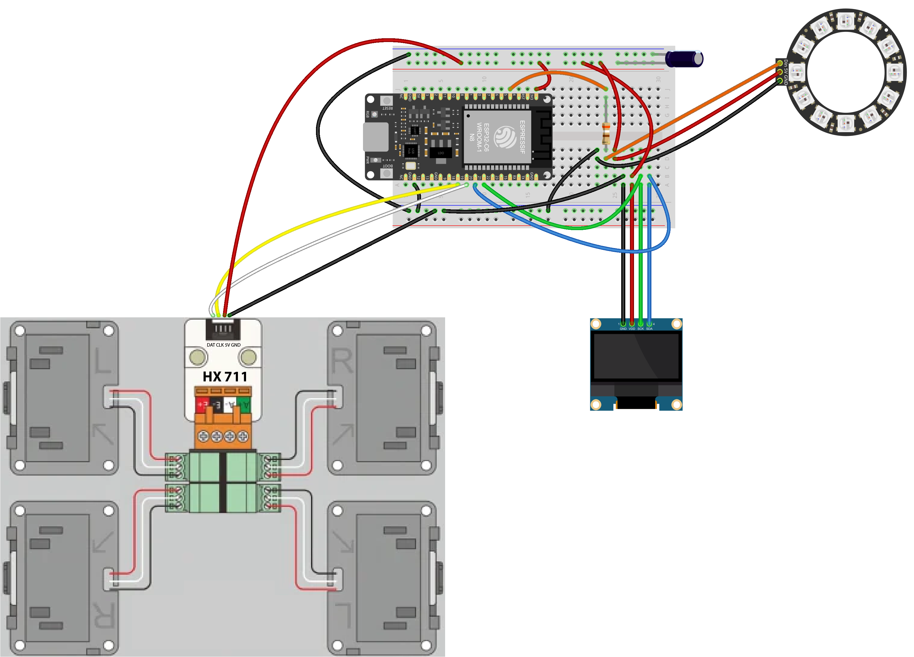

# IM4
Leistungsnachweis IM4

# TrinkFit – Ein smartes Trink-Tracking-System mit LED-Erinnerung

**TrinkFit** ist ein smartes Trinkpad, das den Wasserkonsum automatisch erfasst und über ein LED-System an das regelmässige Trinken erinnert. Das Projekt entstand im Rahmen des Moduls **Interaktive Medien IV** an der Fachhochschule Graubünden.

Ziel ist es, eine funktionale und visuell unterstützende Lösung zu entwickeln, die Nutzer:innen über 50 motiviert, über den Tag hinweg ausreichend zu trinken – ohne aktive App oder ständiges Tippen auf dem Smartphone.

Wie das TrinkfitPad funktioniert sieht man in diesem Video:

Link zu unserer Website: https://trinkfit.wanaka.ch/

---

## 💡 Projektidee

Die Idee basiert auf der Beobachtung, dass viele Menschen zu wenig trinken – besonders während Beschäftigungen durch den Tag. In Interviews mit zwei Zielpersonen wurde deutlich, dass visuelle Signale wie Licht und ein möglichst automatischer Ablauf zum trinken animieren würden.

TrinkFit erkennt Trinkvorgänge automatisch und bietet Feedback über Lichtsignale (LED-Ring) und ein OLED-Display. Zusätzlich werden die Daten an eine Online-Datenbank übertragen und anschliessend auf seiner Website grafisch aufbereitet.

Unsere Idee haben wir zu Beginn des Projekts in einem Flussdiagramm aufgezeichnet:

Hier Flussdiagramm einbauen:

Link zu unserem Figma-Mockup:

---

## ⚙️ So wird das TrinkFit-Pad bedient:

1. Schliesse das TrinkFit Pad am Strom an und starte es.
2. Warte 10 Sekunden und folge den Anweisungen auf dem Display. 
3. Stelle dein volles Glas auf das TrinkFit Pad. 
4. Trinke aus dem Glas und stelle es immer wieder zurück auf das TrinkFit Pad.
5. Glas leer getrunken? Fülle es einfach wieder auf oder nimm das Glas vom TrinkFit Pad und stelle es mit dem Knopf wieder auf Tara. Nach 10 Sekunden ist das TrinkFit Pad wieder einsatzfähig.
6. Beobachte deinen Fortschritt hier online und trink dich fit.
7. Vergessen zu trinken? Mit einem Blinken erinnert dich das TrinkFit Pad nach zwei Stunden daran. Sobald du trinkst, hört es wieder auf.

Eine detaillierte Bedienungsanleitung mit zusätzlichen Anmerkungen und Ergänzungen ist unter folgendem Link zu finden:
https://docs.google.com/document/d/1XEH3uDcnz3PhZMaaVluLnOC8TfT7FdvxlLkdgI5IRxk/edit?usp=sharing

---

## Technische Umsetzung

Diese technischen Funktionen hat unser TrinkFit Pad:

- Automatische Erkennung von Trinkmengen (via HX711-Wägezelle)
- OLED-Anzeige mit Status- und Bedienhinweisen
- LED-Ring für visuelles Feedback:
  - Startanimation bei Inbetriebnahme
  - Erinnerung nach Inaktivität (animierter Farbwechsel)
  - Erfolgssignal nach Trinkvorgang (grün)
  - Fehlerhinweis bei fehlgeschlagener Messung (rot)
- Datenübertragung an eine Online-Datenbank
- Visualisierung der Daten auf einer externen Website

Um das umzusetzen waren verschiedene Schritte nötig.
1. Hardware aufbauen
2. ESP32 programmieren
3. Datenbank aufsetzen 
4. Server aufsetzen 
5. Website programmieren und veröffentlichen

Unter diesem Link ist eine detaillierte Schritt-für-Schritt Bauanleitung abgespeichert, um das Projekt nachzubauen (inklusive Steckschema): 

Hier ein Bild vom Steckschema:

## Komponentenübersicht:

Für die Umsetzung unseres Projekt sind folgende Komponenten nötig:

| Komponente             | Funktion                                                       |
|------------------------|----------------------------------------------------------------|
| ESP32 Dev Board        | Mikrocontroller, führt Hauptprogramm aus, kommuniziert via WLAN |
| HX711 + Wägezelle      | Gewichtssensor zur Erkennung der Trinkmenge                    |
| SSD1306 OLED Display   | Zeigt Hinweise und Statusmeldungen an                         |
| WS2812B LED-Ring       | Gibt visuelles Feedback (Erinnerung, Erfolg etc.)              |
| Powerbank (5 V)        | Mobile Stromversorgung über USB                                |

#### Protokolle & Verbindungen

| Verbindung / Protokoll | Funktion                                                        |
|------------------------|-----------------------------------------------------------------|
| GPIO                   | Datenübertragung zwischen ESP32 und Sensoren (z. B. HX711, LED) |
| I²C                    | Kommunikation mit dem OLED Display (SDA D20, SCL D21)           |
| WLAN (WiFi)            | Verbindung des ESP32 mit dem Webserver                          |
| HTTP (POST)            | Sendet JSON-Daten vom ESP32 an den Server (`load.php`)          |
| SQL (MySQL)            | Datenübertragung zwischen PHP und Datenbank                     |

#### Programmlogik / Steuerung

| Datei / Modul          | Funktion                                                       |
|------------------------|----------------------------------------------------------------|
| `mc.ino`               | Arduino-Hauptprogramm: Gewichtsmessung, Anzeige, Logik         |
| `load.php`             | Serverlogik: Empfängt Daten und schreibt sie in die Datenbank  |
| `chart_data.php`       | Serverlogik: Stellt gespeicherte Trinkdaten als JSON bereit    |
| `chart.js`             | Visualisiert Daten auf der Website                             |
| `tipps.js`             | Zeigt zufällige Trinktipps im Frontend                         |

#### Web-Frontend & Konfiguration

| Komponente             | Funktion                                                       |
|------------------------|----------------------------------------------------------------|
| `index.html`           | Grundstruktur der Website                                      |
| `styles.css`           | Visuelles Styling der Website                                  |
| `db_config.php`        | Stellt Verbindung zur Datenbank her (für PHP)                  |
| Icons, Media, Favicon  | Statische Inhalte zur Darstellung                              |

Die Komponenten sind in Hardware, Protokolle und Software gegliedert und bilden gemeinsam das technische System hinter dem TrinkFit-Pad. Die Programmlogik auf dem ESP32 kommuniziert über WLAN und HTTP mit dem Webserver, wo die Daten gespeichert und anschliessend visualisiert werden. Die Weboberfläche besteht aus HTML, CSS und JavaScript und ruft die Messdaten über PHP-Schnittstellen aus der Datenbank ab.

Hier Komponentenplan einfügen
---

### Programmierung

#### Waage

Das TrinkFit Pad wurde über die **Arduino IDE** programmiert. 

Der Ablauf ist als **Zustandsautomat** implementiert und umfasst die Phasen:
- Warten auf Glas
- Glas erkannt
- Trinken erkannt
- Erinnerung aktivieren

Der vollständige Code ist hier zu finden:
Genauere Erläuterungen zu den Codes sind im Anhang der Schritt-für-Schritt Bauanleitung aufgeführt:

#### Website

Die Website wurde mit Visual Code programmiert.... noch ergänzen

Die gesendeten Daten werden über eine PHP-API (`load.php`) an eine MySQL-Datenbank übermittelt.  
Eine separate Website visualisiert die Trinkhistorie grafisch.

Genauere Erläuterungen zu den Codes sind im Anhang der Schritt-für-Schritt Bauanleitung aufgeführt:

---

## ✍️ Umsetzungsprozess & Reflexion

Hier Reflexion ergänzen:

#### Planung
- Bewusst für LED entschieden und nicht für Ton, da ein Ton zu agressiv wäre.

#### Aufgabenverteilung
#### Entwicklungsprozess
#### verworfene Lösungsansätze
#### Designentscheidungen
#### Inspiration
#### Fehlschläge und Umplanung (z.B. db_config.php hochgeladen)

- Beim Anschliessen des Sensors und der anderen Komponenten auf dem Breadboard, kam es gleich zweinmal vermutlich zu einem Kurzschluss, was den Microcontroller zerstört hat. Der Grund war, dass Stromzuflüsse falsch gesteckt wurden, wodurch auf dem Board vermutlich zu viel Strom floss. Zum Glück haben wir von Jan schnell einen Ersatz bekommen. 

- Leider ist auch die erste Waage, die wir auf Alibaba bestellt haben kaputt gegangen. Die Kabelverbindungen am HX711 Sensor lösten sich und da wir keine Erfahrung im Löten haben, konnten wir ihn nicht flicken. Wir haben schliesslich eine stabilere Waage neu bestellt, die nun im Einsatz ist.

- Im Prozess der Datenbankerstellung haben wir einmal ausversehen das Dokument db_config.php auf GitHub geladen, da wir den Namen des Dokuments angepasst, aber es nicht in gitignore geändert haben. Anschliessend haben wir das Dokument über den Task Manager von Visual Codes wieder aus GitHub entfernt. Zudem haben wir das Login und Passwort angepasst, um die Sicherheit zu gewährleisten. 

#### Challenges
#### Lerneffekte (z.B. Erkenntnisse im Umgang mit Stromversorgung, Kalibrierung)
#### Known Bugs (Optimierungspotenzial)

- Die Waage ist manchmal fehleranfällig. Insbesondere beim ersten Gebrauch (wenn sie sich mit einem neuen WLAN verbindet), bei einer unruhigen Unterlage oder wenn sie mit einem schweren Trinkgefäss verwendet wird. Zudem driftet die Gewichtsmessung der Waage bei langem Gebrauch ab, wodurch falsche Messergebnisse (Trinkgefäss + Wasser) auf dem Display angezeigt werden. Das hat allerdings keinen Einfluss auf die Messung der Trinkmessung. Durch die eingebauten Sicherheitsmechanismen im Code kommt es so gut wie nie zu falschen Trinkmessungen, die in der Datenbank landen. Zudem sind die Trinkmessungen gemäss unserer Einschätzung bis auf ca. 10ml genau (wir haben die Waage über 3 Wochen lang regelmässig getestet). Daher sind wir mit der Genauigkeit der Waage sehr zufrieden. 

#### Mögliche Erweiterungen für TrinkFit

- Eine Möglichkeit einbauen, um auf der Website von Hand Werte einzutragen. (Haben wir bewusst nicht gemacht, da man so zum Schummeln neigt.)
- Personalisiertes Login auf die Website mit detaillierten Statistiken
- Optimierung der Hardware, z.B. kompakteres Gehäuse

#### Hilfsmittel (KI erlaubt und erwünscht)

- Für die Umsetzung des Projekts wurde ChatGPT als Hilfsmittel in fast allen Projektphasen eingesetzt. Besonders hilfreich war ChatGPT bei der Programmierung des Arduino Codes. So konnte der Code Schritt für Schritt überarbeitet und weiterentwickelt werden. 

Auch bei der Umsetzung der Website mittels PHP, JavaScript, HTML und CSS kam ChatGPT zum Einsatz. Zudem auch getwaves.io zur Generierung der Wellen im Header und Footer Bereich. Die KI hat dabei Schritt für Schritt beim Aufbau, der Umsetzung und Fehlersuche geholfen.

ChatGPT wurde auch genutzt, um Teile der Dokumenation zu schreiben oder um sie auf die Rechtschreibung zu überprüfen. Allerdings lieferte ChatGPT bei der Textgenerierung der Dokumentation meist keine zufriedenstellende Ergebnisse. So konnten die Texte zwar als Ausgangslage genutzt, mussten aber von Hand optimiert werden.

---

## Fazit

Hier ein kleines Fazit ergänzen.

- Lernfortschritt

---

## 👥 Projektteam

- **Wanaka Emmenegger**
- **Milena Stadelmann** 

FH Graubünden  
Modul: Interaktive Medien IV – Frühling 2025

---

